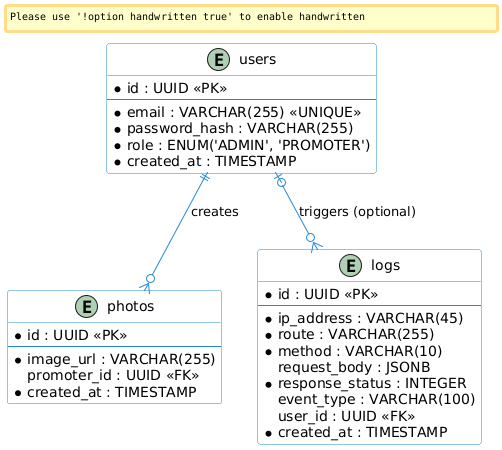

# PhotoOpp - Nexlab Totem Experience

Solução desenvolvida para o desafio técnico proposto pela NexLab. O projeto simula a experiência de um totem de ativação em eventos, onde o usuário realiza a captura de uma foto personalizada com moldura e recebe acesso imediato via QR Code para download.

## Links de Acesso

* **Frontend (Totem e Administração):** [https://photo-opp-app.vercel.app](https://photo-opp-app.vercel.app)

**Nota de Desempenho:** A API está hospedada no plano gratuito do Render. Devido à política de inatividade do serviço, o servidor entra em modo de espera (standby). O primeiro acesso após um período de inatividade pode levar entre 30 segundos e 1 minuto para a inicialização completa da instância; após este processo, o serviço funcionará normalmente.

## Credenciais de Acesso

Para fins de avaliação e demonstração, utilize os perfis abaixo:

| Perfil | E-mail | Senha |
| :--- | :--- | :--- |
| **Administrador** | `admin@nexlab.com` | `admin123` |
| **Promotor** | `joao@nexlab.com` | `promotor123` |
| **Promotor (Padrão)** | `promotor@nexlab.com` | `promotor123` |

## Arquitetura da Solução

A aplicação foi construída visando resiliência e escalabilidade, adotando uma arquitetura de serviços integrados:

1. **Processamento de Imagem (Sharp):** O backend processa o buffer da imagem recebida, realiza o redimensionamento dinâmico da moldura (`frame.png`) e executa a composição (overlay) para gerar o arquivo final.
2. **Armazenamento em Nuvem (Cloudinary):** Integração com o Cloudinary via stream para o armazenamento permanente e entrega otimizada das imagens processadas.
3. **Persistência de Dados (Neon + Prisma):** Utilização de PostgreSQL (Neon) com Prisma ORM para gestão de usuários, logs de auditoria e referências das capturas.
4. **Segurança e Governança:** Implementação de controle de acesso baseado em funções (RBAC) com níveis ADMIN e PROMOTER, além de uma camada de middleware para auditoria de todas as requisições do sistema.

### Modelagem de Dados

A estrutura do banco de dados foi projetada com foco em performance para o painel administrativo, utilizando índices em colunas críticas para otimização de filtros temporais.

## Tecnologias Utilizadas

* **Frontend:** React, Vite, Tailwind CSS, Recharts (Visualização de Dados) e Lucide React.
* **Backend:** Node.js, Express, TypeScript e Multer.
* **Infraestrutura:** Cloudinary (Media Storage), Render (API Hosting) e Vercel (Frontend Hosting).

## Execução em Ambiente Local

1. Clone o repositório.
2. **Configuração do Backend:**
   * Navegue até a pasta `backend` e execute `npm install`.
   * Configure o arquivo `.env` com as credenciais do Cloudinary e a `DATABASE_URL` do Neon.
   * Gere o cliente do Prisma com `npm run prisma:generate`.
   * Inicie o serviço com `npx tsx src/server.ts`.
3. **Configuração do Frontend:**
   * Navegue até a pasta `frontend` e execute `npm install`.
   * Configure a variável `VITE_API_URL` no `.env`.
   * Inicie a aplicação com `npm run dev`.
